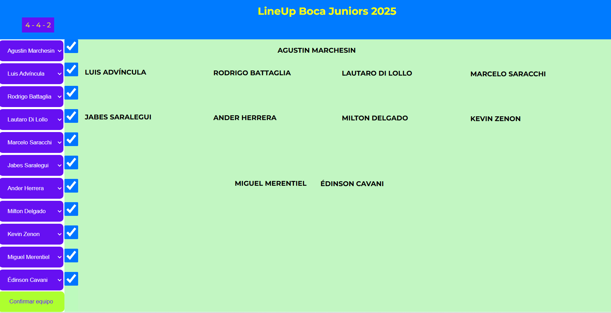

# Selección de Jugadores de Fútbol

Este proyecto permite a los usuarios seleccionar jugadores de fútbol de diferentes posiciones (arquero, defensores, mediocampistas y delanteros) mediante una interfaz sencilla que incluye listas desplegables y casillas de verificación. Al confirmar la selección, se mostrarán los jugadores elegidos.

## Descripción del Código

El código utiliza JavaScript para interactuar con el DOM, creando dinámicamente opciones en los elementos `<select>` y asociando casillas de verificación a cada una de ellas. Esto permite que, al marcar una casilla, se seleccione automáticamente el jugador correspondiente en el menú desplegable.

### Estructura del Código

1. **Definición de Jugadores**:
   - Se define un objeto `players` que contiene arreglos con los nombres de los jugadores divididos por posiciones: `goalkeeper`, `defenders`, `midfielders`, y `attackers`.

2. **Interacción con el DOM**:
   - Se seleccionan elementos del DOM, incluyendo los campos donde se mostrarán los jugadores seleccionados, los elementos de tipo `<select>`, y los botones de confirmación.

3. **Carga Inicial**:
   - Al cargarse el documento (`DOMContentLoaded`), se crean dinámicamente las opciones en los menús desplegables y se agregan casillas de verificación asociadas a cada jugador.

4. **Cambio de Estado de Checkbox**:
   - Se maneja el evento `change` para actualizar el estado `selected` de los `<select>` cuando se marca o desmarca un checkbox.

5. **Confirmación de Selección**:
   - Al hacer clic en el botón de confirmación, se verifica que todas las casillas de verificación estén marcadas. Si es así, se crean elementos `<span>` para mostrar los jugadores seleccionados.

### Vista de la Página


### Ejemplo de HTML

A continuación se muestra un ejemplo de cómo estructurar el HTML para utilizar este código:

```html
<div class="game"></div>
<div class="checkboxes"></div>
<button class="confirm">Confirmar Selección</button>
